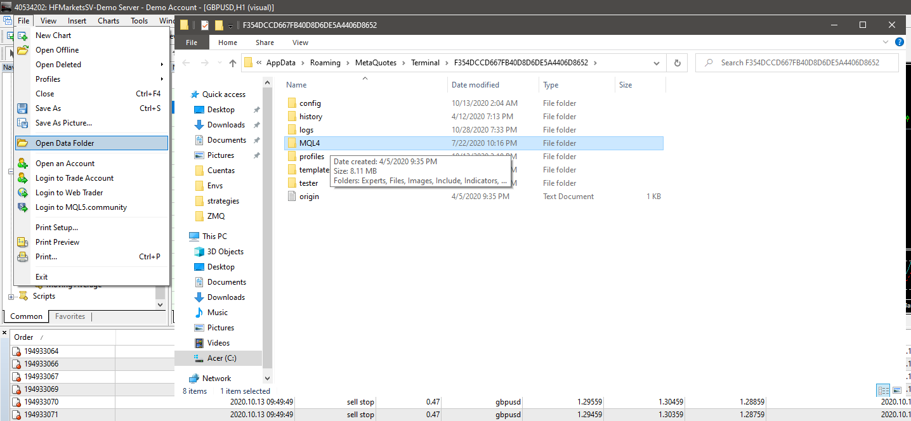
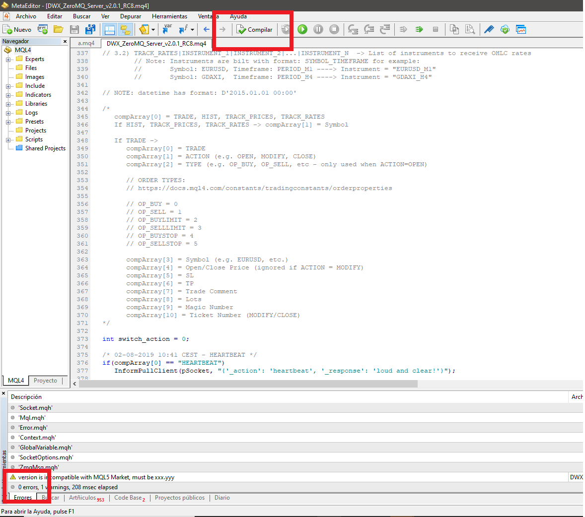
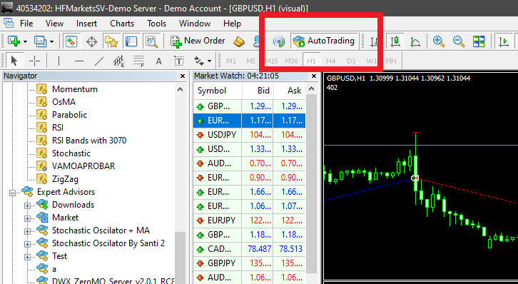
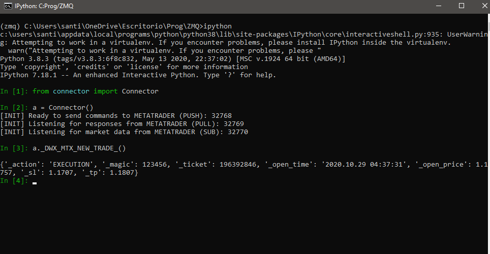

# ZMQ para Python
> ZMQ es una librería para python que administra la relación con mql.

## Archivos y Carpetas del Repo

1- pkgs.py:
```sh
Requisitos para python.
```

2- connector.py, execution.py y reporting.py:
```sh
Hacen de modelo y contacto con mql, con todas las funciones definidas para trabajar 
(principalmente en connector).
```

3- strategy.py:
```sh
Oficia como constructor de estrategias (hereda de connector las funcionalidades).
```

4- A-Historic.py, A-Rates.py y otros .py:
```sh
Estrategias y pruebas (se encuentran en esa carpeta debido a problemas para importar 
desde otro directorio).
```

5- Resourses:
```sh
image: imágenes explicativas para README.
MetaTrader4: Archivos y carpetas que se utilizaran en la instalación.
```
## Instalación para MetaTrader 4

1- Instalar librerias necesarias de `pkgs.txt`:
```sh
pip install -r pkgs.txt
```

2- Copiar el Expert Advisor de ZMQ llamado `DWX_ZeroMQ_Server_v2.0.1_RC8`, que
se encuentra en la carpeta `Resourses`. Luego, ir a MetaTrader, hacer click en `File>Open Data Folder`, 
ir a la carpeta `MQL4`, después ingresar en `Experts` y pegar el archivo


3- Copiar los archivos `libsodium.dll` y `libzmq.dll` de la carpeta `Resourses`
y pegarlos en la carpeta `MQL4/Libraries`, de forma similar al punto 2

4- Copiar las carpetas `Mql` y `Zmq` e `Resourses` y pegarlo en `MQL/Include`,
idem punto 2.

## Prueba de funcionamiento

1- En MetaTrader, en la seccion `Navigator`, hacer click derecho en el Expert Advisor
`DWX_ZeroMQ_Server_v2.0.1_RC8` y apretar en `Modify`. Una vez en el Ide de MetaTrader,
hacer click en `Compile`. En caso de que este todo correctamente instalado, deberá
devolver el mensaje, en la parte inferior izquierda, de 0 errores.


2- Activar la opción `AutoTrading`


3- Arrastrar el Expert Advisor de ZMQ a un gráfico nuevo !!EN UNA CUENTA DEMO!!, del par deseado.

4- Abrir un shell, activar el entorno donde se encuentren las librerías instaladas en
el punto 1 de las instalaciones. Ir a la carpeta donde se encuentre el archivo `connector`,
activar un shell interactivo como Ipython.

5- Importar la Clase constructora `Connector` de `connector.py`.
```sh
from connector import Connector
```
Generar una instancia de la clase Connector:
```sh
a = Connector()
```

Y por ultimo, ejecutar la funcion `_DWX_MTX_NEW_TRADE_()`, la cual genera un trade al azar
(por esto es necesario que sea una cuenta demo).
```sh
a._DWX_MTX_NEW_TRADE_()
```


Esto devolverá los datos el trade generado en caso de realizarse correctamente, simplemente con ir a la pestaña de `Trade` en `MetaTrader`
y hacer click en la cruz, se cerrará el trade generado.

## Historial de versiones

* 0.0.1
    * Hola Mundo!

## Más

Repo de darwinex donde se extrajo los conectores y archivos de mql: https://github.com/darwinex/dwx-zeromq-connector

Videotutorial para la instalación de ZMQ en MQL y Python: https://youtu.be/Qv04zPU7lxQ
